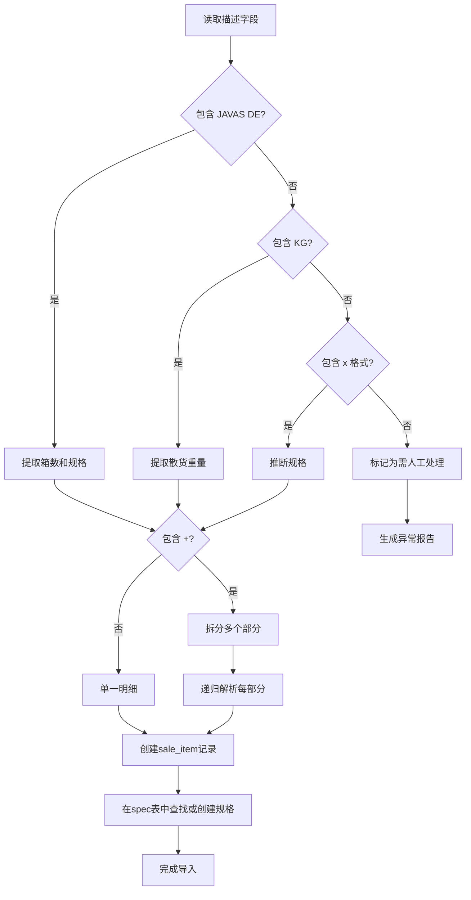
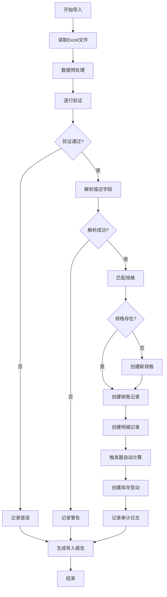

# Excel 数据导入方案设计

## 一、导入需求分析

### 1.1 源数据格式（基于 table01.jpg）

根据现有Excel表格，包含以下字段：

| Excel列名 | 数据类型 | 示例值 | 说明 |
|----------|---------|--------|------|
| Fecha | 日期时间 | 2024-12-15 10:30 | 销售时间 |
| Usuario | 文本 | Jose Burgueno | 操作员 |
| ID | 文本 | SALE-20241215-001 | 销售单号 |
| Tipo | 文本 | Venta | 固定值，不导入 |
| Categoría | 文本 | Sin categoría | 固定值，不导入 |
| Método de pago | 文本 | Otro | 固定值，不导入 |
| Tipo de pago | 文本 | Crédito/现金 | 支付方式 |
| Descripción | 文本 | 2 JAVAS DE 39X110 + 5KG | **需要解析** |
| Productos | 文本 | - | 从描述中提取 |
| Contacto | 文本 | DANIEL HIELO | 客户名称 |

### 1.2 核心挑战：描述字段解析

**Descripción 字段包含自由文本，需要智能解析为结构化数据**

#### 常见格式模式：

1. **单规格整箱**：
   - `2 JAVAS DE 39X110` → 2箱 JAVA 39x110
   - `3 JAVAS DE 38X104` → 3箱 JAVA 38x104

2. **单规格带散货**：
   - `2 JAVAS DE 39X110 + 5KG` → 2箱 + 5kg散货
   - `1 JAVA DE 38X115 + 10KG` → 1箱 + 10kg散货

3. **多规格组合**：
   - `2 JAVAS DE 39X110 + 3 JAVAS DE 38X104` → 需拆分为2条明细
   - `1 JAVA DE 39X110 + 2 JAVAS DE 38X115 + 5KG` → 复杂组合

4. **纯散货**：
   - `15 KG` → 0箱 + 15kg散货
   - `20 KG X 110` → 需要推断规格

5. **特殊格式**：
   - `JAVA 39X110 (2 CAJAS)` → 2箱
   - `39X110 - 2 UNIDADES` → 2箱

---

## 二、解析策略设计

### 2.1 正则表达式模式

```python
import re

# 模式1: 标准格式 "数量 JAVAS DE 长x宽"
PATTERN_STANDARD = r'(\d+)\s*JAVAS?\s+DE\s+(\d+)\s*[xX×]\s*(\d+)'

# 模式2: 散货 "数量 KG"
PATTERN_EXTRA_KG = r'(\d+(?:\.\d+)?)\s*KG'

# 模式3: 简化格式 "长x宽"
PATTERN_SIMPLE = r'(\d+)\s*[xX×]\s*(\d+)'

# 模式4: 带单位 "数量 CAJAS/UNIDADES"
PATTERN_UNITS = r'(\d+)\s*(?:CAJAS?|UNIDADES?)'
```

### 2.2 解析流程图



### 2.3 规格匹配策略

#### 精确匹配
```python
def find_spec_exact(length, width):
    """精确匹配规格"""
    return db.query(Spec).filter(
        Spec.length == length,
        Spec.width == width,
        Spec.active == True
    ).first()
```

#### 模糊匹配（容差±2cm）
```python
def find_spec_fuzzy(length, width, tolerance=2):
    """模糊匹配规格（允许±2cm误差）"""
    return db.query(Spec).filter(
        Spec.length.between(length - tolerance, length + tolerance),
        Spec.width.between(width - tolerance, width + tolerance),
        Spec.active == True
    ).first()
```

#### 自动创建新规格
```python
def create_spec_if_not_exists(length, width, default_kg=15):
    """如果规格不存在，自动创建"""
    spec = find_spec_exact(length, width)
    if not spec:
        spec = Spec(
            name=f"JAVA {length}x{width}",
            length=length,
            width=width,
            kg_per_box=default_kg,  # 默认重量，需后续调整
            active=True,
            created_by='import_system'
        )
        db.add(spec)
        db.commit()
    return spec
```

---

## 三、导入程序设计

### 3.1 程序架构

```
excel_importer/
├── __init__.py
├── parser.py           # 描述字段解析器
├── validator.py        # 数据验证器
├── importer.py         # 主导入逻辑
├── spec_matcher.py     # 规格匹配器
├── report_generator.py # 导入报告生成器
└── config.py           # 配置文件
```

### 3.2 核心类设计

#### DescriptionParser 类

```python
class DescriptionParser:
    """描述字段解析器"""
    
    def parse(self, description: str) -> List[ParsedItem]:
        """
        解析描述字段
        
        Args:
            description: 原始描述文本
            
        Returns:
            List[ParsedItem]: 解析后的明细列表
        """
        # 1. 预处理：统一格式
        description = self._normalize(description)
        
        # 2. 按 + 号拆分
        parts = self._split_by_plus(description)
        
        # 3. 解析每个部分
        items = []
        for part in parts:
            item = self._parse_single_part(part)
            if item:
                items.append(item)
        
        return items
    
    def _normalize(self, text: str) -> str:
        """标准化文本格式"""
        text = text.upper()
        text = re.sub(r'\s+', ' ', text)  # 多空格转单空格
        text = text.replace('×', 'X').replace('x', 'X')
        return text.strip()
    
    def _parse_single_part(self, part: str) -> Optional[ParsedItem]:
        """解析单个部分"""
        # 尝试各种模式
        if match := re.search(PATTERN_STANDARD, part):
            qty, length, width = match.groups()
            return ParsedItem(
                box_qty=int(qty),
                length=int(length),
                width=int(width),
                extra_kg=0
            )
        
        if match := re.search(PATTERN_EXTRA_KG, part):
            kg = float(match.group(1))
            return ParsedItem(
                box_qty=0,
                extra_kg=kg,
                needs_spec_inference=True
            )
        
        # 其他模式...
        return None
```

#### DataValidator 类

```python
class DataValidator:
    """数据验证器"""
    
    def validate_row(self, row: dict) -> ValidationResult:
        """验证单行数据"""
        errors = []
        warnings = []
        
        # 必填字段检查
        if not row.get('Fecha'):
            errors.append("缺少销售时间")
        
        if not row.get('Contacto'):
            errors.append("缺少客户名称")
        
        if not row.get('Descripción'):
            errors.append("缺少商品描述")
        
        # 数据格式检查
        if row.get('Tipo de pago') not in ['现金', 'Crédito', None]:
            warnings.append(f"未知支付方式: {row.get('Tipo de pago')}")
        
        # 逻辑检查
        if row.get('total_kg', 0) <= 0:
            warnings.append("总重量为0或负数")
        
        return ValidationResult(
            is_valid=len(errors) == 0,
            errors=errors,
            warnings=warnings
        )
```

#### ExcelImporter 类

```python
class ExcelImporter:
    """Excel导入器"""
    
    def __init__(self, db_session):
        self.db = db_session
        self.parser = DescriptionParser()
        self.validator = DataValidator()
        self.spec_matcher = SpecMatcher(db_session)
        
    def import_file(self, file_path: str, 
                   dry_run: bool = False) -> ImportReport:
        """
        导入Excel文件
        
        Args:
            file_path: Excel文件路径
            dry_run: 是否仅验证不导入
            
        Returns:
            ImportReport: 导入报告
        """
        # 1. 读取Excel
        df = pd.read_excel(file_path)
        
        # 2. 初始化报告
        report = ImportReport()
        
        # 3. 逐行处理
        for idx, row in df.iterrows():
            try:
                # 验证数据
                validation = self.validator.validate_row(row)
                if not validation.is_valid:
                    report.add_error(idx, validation.errors)
                    continue
                
                # 解析描述
                items = self.parser.parse(row['Descripción'])
                if not items:
                    report.add_warning(idx, "无法解析商品描述")
                    continue
                
                # 导入数据
                if not dry_run:
                    self._import_sale(row, items)
                
                report.add_success(idx)
                
            except Exception as e:
                report.add_error(idx, str(e))
        
        return report
    
    def _import_sale(self, row: dict, items: List[ParsedItem]):
        """导入单条销售记录"""
        # 1. 查找或创建客户
        customer = self._get_or_create_customer(row['Contacto'])
        
        # 2. 创建销售单
        sale = Sale(
            id=row.get('ID') or self._generate_sale_id(),
            sale_time=row['Fecha'],
            customer_id=customer.id,
            payment_type=row.get('Tipo de pago', '现金'),
            created_by=row.get('Usuario', 'import_system')
        )
        self.db.add(sale)
        
        # 3. 创建销售明细
        for item in items:
            spec = self.spec_matcher.match(item.length, item.width)
            if not spec:
                spec = self.spec_matcher.create_new(
                    item.length, item.width
                )
            
            sale_item = SaleItem(
                sale_id=sale.id,
                spec_id=spec.id,
                box_qty=item.box_qty,
                extra_kg=item.extra_kg
            )
            self.db.add(sale_item)
        
        # 4. 提交事务
        self.db.commit()
```

---

## 四、导入流程设计

### 4.1 完整导入流程



### 4.2 分阶段导入策略

#### 阶段1：验证模式（Dry Run）
```python
# 只验证不导入，生成问题报告
report = importer.import_file('sales.xlsx', dry_run=True)
print(report.summary())
```

#### 阶段2：部分导入
```python
# 只导入验证通过的记录
report = importer.import_file('sales.xlsx', 
                             skip_errors=True,
                             dry_run=False)
```

#### 阶段3：完整导入
```python
# 导入所有记录，错误记录需人工处理
report = importer.import_file('sales.xlsx', 
                             dry_run=False,
                             create_missing_specs=True)
```

---

## 五、异常处理策略

### 5.1 异常分类

| 异常类型 | 处理策略 | 示例 |
|---------|---------|------|
| **致命错误** | 跳过该记录 | 缺少必填字段 |
| **警告** | 导入但标记 | 规格不存在但可创建 |
| **信息** | 正常导入 | 使用默认值 |

### 5.2 异常记录表设计

```sql
CREATE TABLE import_exception (
    id INTEGER PRIMARY KEY AUTOINCREMENT,
    import_batch_id VARCHAR(50) NOT NULL,
    row_number INTEGER NOT NULL,
    error_type VARCHAR(20) NOT NULL,  -- 'ERROR', 'WARNING', 'INFO'
    error_message TEXT NOT NULL,
    original_data TEXT,  -- JSON格式存储原始数据
    suggested_fix TEXT,  -- 建议的修复方案
    status VARCHAR(20) DEFAULT 'pending',  -- 'pending', 'fixed', 'ignored'
    created_at DATETIME DEFAULT CURRENT_TIMESTAMP
);
```

### 5.3 人工干预界面

需要提供Web界面用于：
1. 查看导入异常列表
2. 手动修正数据
3. 重新导入失败记录
4. 批量处理相似问题

---

## 六、导入报告设计

### 6.1 报告内容

```python
class ImportReport:
    """导入报告"""
    
    def __init__(self):
        self.total_rows = 0
        self.success_count = 0
        self.error_count = 0
        self.warning_count = 0
        self.errors = []
        self.warnings = []
        self.new_specs_created = []
        self.new_customers_created = []
        self.start_time = None
        self.end_time = None
    
    def summary(self) -> str:
        """生成摘要报告"""
        return f"""
导入报告
{'='*60}
总记录数: {self.total_rows}
成功导入: {self.success_count}
失败记录: {self.error_count}
警告记录: {self.warning_count}
新建规格: {len(self.new_specs_created)}
新建客户: {len(self.new_customers_created)}
耗时: {self.duration()}
{'='*60}
"""
    
    def to_excel(self, output_path: str):
        """导出为Excel报告"""
        with pd.ExcelWriter(output_path) as writer:
            # 摘要页
            summary_df = pd.DataFrame([{
                '总记录数': self.total_rows,
                '成功': self.success_count,
                '失败': self.error_count,
                '警告': self.warning_count
            }])
            summary_df.to_excel(writer, sheet_name='摘要', index=False)
            
            # 错误详情页
            if self.errors:
                errors_df = pd.DataFrame(self.errors)
                errors_df.to_excel(writer, sheet_name='错误详情', index=False)
            
            # 新建规格页
            if self.new_specs_created:
                specs_df = pd.DataFrame(self.new_specs_created)
                specs_df.to_excel(writer, sheet_name='新建规格', index=False)
```

### 6.2 报告示例

```
导入报告
============================================================
总记录数: 150
成功导入: 142
失败记录: 5
警告记录: 3
新建规格: 2
新建客户: 1
耗时: 2.5秒
============================================================

错误详情:
行号 | 错误类型 | 错误信息 | 原始数据
-----|---------|---------|----------
15   | ERROR   | 缺少客户名称 | {"Fecha": "2024-12-15", ...}
28   | ERROR   | 无法解析描述 | {"Descripción": "???", ...}
45   | WARNING | 规格不存在，已自动创建 | {"Descripción": "40x125", ...}

新建规格:
规格名称 | 长度 | 宽度 | 默认重量
---------|------|------|----------
JAVA 40x125 | 40 | 125 | 15
JAVA 35x95  | 35 | 95  | 10
```

---

## 七、性能优化

### 7.1 批量导入优化

```python
def import_batch(self, rows: List[dict], batch_size: int = 100):
    """批量导入优化"""
    for i in range(0, len(rows), batch_size):
        batch = rows[i:i+batch_size]
        
        # 批量创建对象
        sales = []
        sale_items = []
        
        for row in batch:
            sale = self._create_sale_object(row)
            sales.append(sale)
            
            items = self._create_sale_items(row, sale.id)
            sale_items.extend(items)
        
        # 批量插入
        self.db.bulk_save_objects(sales)
        self.db.bulk_save_objects(sale_items)
        self.db.commit()
```

### 7.2 缓存策略

```python
class CachedSpecMatcher:
    """带缓存的规格匹配器"""
    
    def __init__(self, db_session):
        self.db = db_session
        self._cache = {}  # {(length, width): spec_id}
        self._load_cache()
    
    def _load_cache(self):
        """预加载所有规格到缓存"""
        specs = self.db.query(Spec).filter(Spec.active == True).all()
        for spec in specs:
            key = (spec.length, spec.width)
            self._cache[key] = spec.id
    
    def match(self, length: int, width: int) -> Optional[int]:
        """从缓存中匹配规格"""
        return self._cache.get((length, width))
```

---

## 八、使用示例

### 8.1 命令行工具

```bash
# 验证模式
python import_excel.py --file sales.xlsx --dry-run

# 导入模式
python import_excel.py --file sales.xlsx --import

# 生成报告
python import_excel.py --file sales.xlsx --import --report report.xlsx

# 跳过错误继续导入
python import_excel.py --file sales.xlsx --import --skip-errors

# 自动创建缺失规格
python import_excel.py --file sales.xlsx --import --create-specs
```

### 8.2 Python API

```python
from excel_importer import ExcelImporter
from database import get_db_session

# 创建导入器
db = get_db_session()
importer = ExcelImporter(db)

# 导入文件
report = importer.import_file(
    'sales.xlsx',
    dry_run=False,
    skip_errors=True,
    create_missing_specs=True
)

# 查看报告
print(report.summary())

# 导出详细报告
report.to_excel('import_report.xlsx')

# 处理异常
for error in report.errors:
    print(f"行 {error.row_number}: {error.message}")
```

---

## 九、测试计划

### 9.1 单元测试

```python
def test_parse_standard_format():
    """测试标准格式解析"""
    parser = DescriptionParser()
    items = parser.parse("2 JAVAS DE 39X110")
    assert len(items) == 1
    assert items[0].box_qty == 2
    assert items[0].length == 39
    assert items[0].width == 110

def test_parse_with_extra_kg():
    """测试带散货格式"""
    parser = DescriptionParser()
    items = parser.parse("2 JAVAS DE 39X110 + 5KG")
    assert len(items) == 1
    assert items[0].box_qty == 2
    assert items[0].extra_kg == 5

def test_parse_multiple_specs():
    """测试多规格组合"""
    parser = DescriptionParser()
    items = parser.parse("2 JAVAS DE 39X110 + 3 JAVAS DE 38X104")
    assert len(items) == 2
```

### 9.2 集成测试

```python
def test_full_import_workflow():
    """测试完整导入流程"""
    # 准备测试数据
    test_file = create_test_excel()
    
    # 执行导入
    importer = ExcelImporter(test_db)
    report = importer.import_file(test_file)
    
    # 验证结果
    assert report.success_count > 0
    assert report.error_count == 0
    
    # 验证数据库
    sales = test_db.query(Sale).all()
    assert len(sales) > 0
```

---

## 十、部署清单

### 10.1 依赖包

```txt
pandas>=2.0.0
openpyxl>=3.1.0
sqlalchemy>=2.0.0
python-dateutil>=2.8.0
```

### 10.2 配置文件

```yaml
# import_config.yaml
excel:
  encoding: utf-8
  date_format: "%Y-%m-%d %H:%M"
  
parser:
  default_spec_weight: 15  # 新规格默认重量
  fuzzy_match_tolerance: 2  # 模糊匹配容差(cm)
  
import:
  batch_size: 100
  skip_errors: false
  create_missing_specs: true
  create_missing_customers: true
  
report:
  output_format: excel
  include_warnings: true
```

---

## 十一、后续优化方向

1. **AI辅助解析**：使用机器学习提高描述字段解析准确率
2. **增量导入**：支持只导入新增记录
3. **数据清洗**：自动修正常见错误（如全角/半角、大小写）
4. **并行处理**：大文件多线程导入
5. **实时预览**：导入前预览解析结果
6. **模板管理**：支持多种Excel模板格式

---

**文档版本**: 1.0  
**创建日期**: 2026-01-05  
**作者**: Claude
