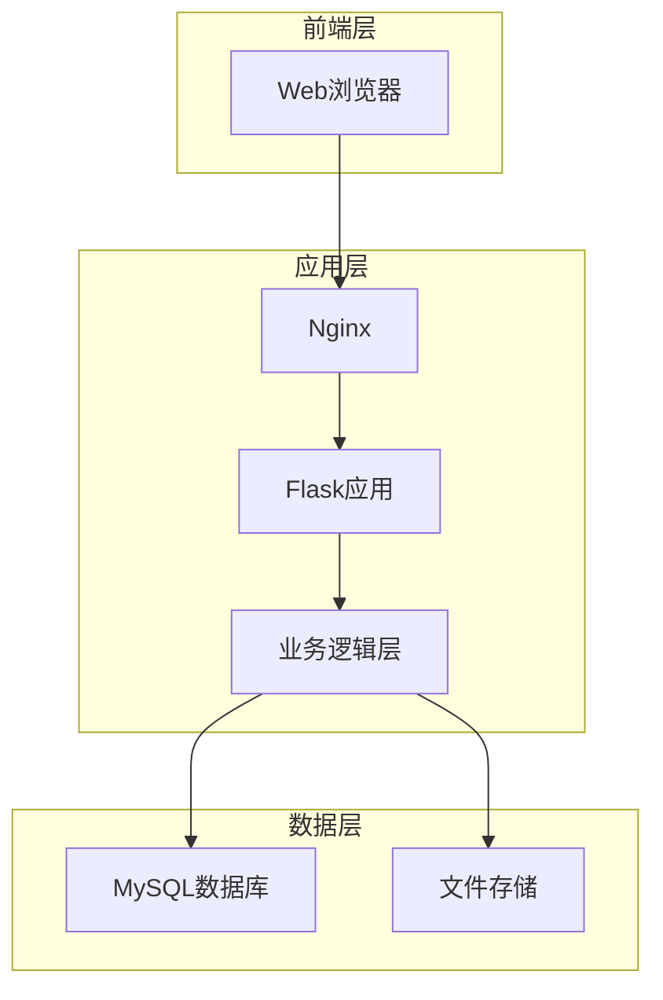

# 销售管理系统 - 项目总览

**版本**: 1.0  
**创建日期**: 2026-01-05  
**项目状态**: 设计完成，待开发

---

## 一、项目概述

### 1.1 项目背景

本项目为销售管理系统，用于管理日常销售业务、库存追溯和数据统计分析。系统严格遵循以下核心原则：

1. ✅ **禁止自由规格输入** - 所有规格必须来自字典表
2. ✅ **重量由系统自动计算** - 禁止人工输入总重量
3. ✅ **库存完全可追溯** - 所有库存变动可复算
4. ✅ **禁止物理删除** - 只能作废，确保对账可信性
5. ✅ **完整审计日志** - 所有关键操作可追溯

### 1.2 核心功能

- **销售管理**: 创建销售单、查看销售记录、作废销售单
- **库存管理**: 库存变动记录、当前库存查询、库存盘点
- **报表统计**: 按日期/客户/规格统计、散货占比分析
- **系统管理**: 规格维护、客户维护、审计日志查询
- **数据导入**: Excel数据批量导入、智能解析

---

## 二、文档结构

### 2.1 核心文档

| 文档名称 | 路径 | 说明 |
|---------|------|------|
| **数据库设计文档** | [`database_design.md`](../database_design.md) | 完整的数据库设计，包含7个核心表、13个触发器、5个视图 |
| **数据库Schema** | [`schema.sql`](../schema.sql) | 数据库初始化脚本，可直接执行 |
| **数据库测试** | [`test_database.sql`](../test_database.sql) | 15个测试场景，验证所有功能 |
| **README** | [`README.md`](../README.md) | 项目说明和快速开始指南 |

### 2.2 设计文档（plans目录）

| 文档名称 | 路径 | 说明 |
|---------|------|------|
| **Excel导入方案** | [`plans/excel_import_design.md`](excel_import_design.md) | Excel数据导入的完整设计方案 |
| **Web应用架构** | [`plans/web_application_architecture.md`](web_application_architecture.md) | Web应用的技术架构和代码结构 |
| **API接口规范** | [`plans/api_specification.md`](api_specification.md) | RESTful API完整接口文档 |
| **部署方案** | [`plans/deployment_guide.md`](deployment_guide.md) | 生产环境部署指南 |
| **项目总览** | [`plans/project_overview.md`](project_overview.md) | 本文档 |

### 2.3 工具脚本

| 脚本名称 | 路径 | 说明 |
|---------|------|------|
| **数据库初始化** | [`init_database.py`](../init_database.py) | 一键初始化数据库和运行测试 |

---

## 三、技术架构

### 3.1 系统架构图

### 3.2 技术栈

| 层级 | 技术 | 版本 |
|-----|------|------|
| **前端** | HTML5 + Bootstrap 5 + Chart.js | 5.3+ |
| **后端** | Python + Flask | 3.10+ / 3.0+ |
| **ORM** | SQLAlchemy | 2.0+ |
| **数据库** | SQLite (开发) / MySQL (生产) | 8.0+ |
| **Web服务器** | Nginx + Gunicorn | 1.24+ / 21.0+ |
| **容器化** | Docker + Docker Compose | 24.0+ |

---

## 四、数据库设计

### 4.1 核心表结构

| 表名 | 用途 | 记录数估算 |
|-----|------|-----------|
| **spec** | 规格字典表 | ~50条 |
| **customer** | 客户表 | ~100条 |
| **sale** | 销售单主表 | 每月~500条 |
| **sale_item** | 销售明细表 | 每月~1500条 |
| **stock_move** | 库存变动表 | 每月~600条 |
| **audit_log** | 审计日志表 | 每月~3000条 |
| **inventory_check** | 盘点记录表 | 每月~4条 |

### 4.2 关键特性

- **自动计算**: 销售明细小计和销售单总计由触发器自动计算
- **库存追溯**: 每笔销售自动创建库存变动记录
- **审计日志**: 所有关键操作自动记录到审计日志
- **数据完整性**: 通过外键、CHECK约束、触发器保证数据一致性

---

## 五、功能模块

### 5.1 销售管理

#### 功能列表
- 创建销售单（支持多规格、散货）
- 查看销售单列表（分页、筛选）
- 查看销售单详情
- 作废销售单（禁止删除）
- 今日销售汇总

#### 业务规则
- 规格必须来自spec表，禁止自由输入
- 重量由系统自动计算，禁止人工修改
- 客户不允许信用时，禁止使用Crédito支付
- 销售单只能作废，不能删除

### 5.2 库存管理

#### 功能列表
- 查看当前库存
- 添加库存变动（进货、调拨、退货、盘盈、盘亏）
- 查看库存变动历史
- 库存盘点对账
- 库存趋势分析

#### 业务规则
- 所有库存变动可追溯
- 销售自动创建库存变动
- 库存不能为负数（应用层校验）
- 盘点差异超过阈值需要警告

### 5.3 报表统计

#### 功能列表
- 按日期统计销售
- 按客户统计销售
- 按规格统计销售
- 散货占比分析
- 客户销售排名
- 规格使用统计

#### 图表展示
- 销售趋势图（折线图）
- 客户销售占比（饼图）
- 规格使用分布（柱状图）
- 库存变动趋势（面积图）

### 5.4 系统管理

#### 功能列表
- 规格维护（增删改查）
- 客户维护（增删改查）
- 审计日志查询
- 用户管理（待实现）
- 系统配置（待实现）

---

## 六、开发计划

### 6.1 阶段划分

#### 第一阶段：数据库和后端核心（2周）
- [x] 数据库设计
- [x] 数据库Schema实现
- [x] 数据库测试
- [ ] Flask应用框架搭建
- [ ] 核心业务逻辑实现
- [ ] API接口实现

#### 第二阶段：前端界面（2周）
- [ ] 基础模板和布局
- [ ] 销售管理页面
- [ ] 库存管理页面
- [ ] 报表统计页面
- [ ] 系统管理页面

#### 第三阶段：Excel导入（1周）
- [ ] 描述字段解析器
- [ ] 规格匹配器
- [ ] 导入服务实现
- [ ] 导入报告生成

#### 第四阶段：测试和优化（1周）
- [ ] 单元测试
- [ ] 集成测试
- [ ] 性能测试
- [ ] 安全测试
- [ ] Bug修复

#### 第五阶段：部署上线（1周）
- [ ] 生产环境准备
- [ ] 数据迁移
- [ ] 部署配置
- [ ] 上线验证
- [ ] 用户培训

### 6.2 里程碑

| 里程碑 | 预计完成时间 | 交付物 |
|-------|------------|--------|
| M1: 设计完成 | 2026-01-05 | 所有设计文档 ✅ |
| M2: 后端完成 | 2026-01-19 | 可运行的API服务 |
| M3: 前端完成 | 2026-02-02 | 完整的Web界面 |
| M4: 测试完成 | 2026-02-09 | 测试报告 |
| M5: 上线完成 | 2026-02-16 | 生产环境运行 |

---

## 七、风险评估

### 7.1 技术风险

| 风险 | 影响 | 概率 | 应对措施 |
|-----|------|------|---------|
| Excel解析准确率低 | 中 | 中 | 提供人工修正界面，建立解析规则库 |
| 性能问题 | 中 | 低 | 数据库优化，添加缓存，分页查询 |
| 数据迁移失败 | 高 | 低 | 充分测试，准备回滚方案 |

### 7.2 业务风险

| 风险 | 影响 | 概率 | 应对措施 |
|-----|------|------|---------|
| 用户不适应新系统 | 中 | 中 | 提供培训，保留Excel导入功能 |
| 历史数据不完整 | 中 | 中 | 数据清洗，人工补充 |
| 需求变更 | 低 | 高 | 模块化设计，预留扩展接口 |

---

## 八、质量保证

### 8.1 代码质量

- **代码规范**: PEP 8 (Python), ESLint (JavaScript)
- **代码审查**: 所有代码需经过审查
- **单元测试**: 核心业务逻辑覆盖率 > 80%
- **集成测试**: 主要业务流程全覆盖

### 8.2 性能指标

- **响应时间**: API响应 < 500ms
- **并发用户**: 支持50个并发用户
- **数据库查询**: 单次查询 < 100ms
- **页面加载**: 首屏加载 < 2s

### 8.3 安全要求

- **认证授权**: 基于Session的用户认证
- **数据加密**: HTTPS传输，敏感数据加密存储
- **输入验证**: 所有用户输入严格验证
- **SQL注入防护**: 使用ORM，参数化查询
- **CSRF防护**: 所有表单包含CSRF Token

---

## 九、运维要求

### 9.1 备份策略

- **数据库备份**: 每日凌晨2点自动备份
- **备份保留**: 保留最近30天
- **备份验证**: 每周进行恢复测试

### 9.2 监控告警

- **应用监控**: 日志监控，异常告警
- **数据库监控**: 连接数、慢查询、磁盘空间
- **服务器监控**: CPU、内存、磁盘、网络

### 9.3 维护窗口

- **日常维护**: 每天检查日志和备份
- **定期维护**: 每周数据库优化
- **升级窗口**: 每月第一个周日凌晨2-4点

---

## 十、成本估算

### 10.1 开发成本

| 项目 | 工时 | 说明 |
|-----|------|------|
| 数据库设计 | 40h | 已完成 ✅ |
| 后端开发 | 80h | Flask + API |
| 前端开发 | 80h | HTML + Bootstrap |
| Excel导入 | 40h | 解析器 + 导入服务 |
| 测试 | 40h | 单元测试 + 集成测试 |
| 部署上线 | 20h | 环境配置 + 数据迁移 |
| **总计** | **300h** | 约7.5周 |

### 10.2 运维成本（月）

| 项目 | 成本 | 说明 |
|-----|------|------|
| 服务器 | $50 | 云服务器（4核8G） |
| 域名 | $2 | .com域名 |
| SSL证书 | $0 | Let's Encrypt免费 |
| 备份存储 | $10 | 100GB云存储 |
| **总计** | **$62/月** | |

---

## 十一、下一步行动

### 11.1 立即行动

1. ✅ 完成所有设计文档
2. [ ] 搭建开发环境
3. [ ] 创建Git仓库
4. [ ] 初始化Flask项目
5. [ ] 实现核心数据模型

### 11.2 本周计划

- [ ] 完成Flask应用框架搭建
- [ ] 实现销售管理API
- [ ] 实现库存管理API
- [ ] 编写单元测试

### 11.3 下周计划

- [ ] 实现报表统计API
- [ ] 实现系统管理API
- [ ] 完成API文档
- [ ] 开始前端开发

---

## 十二、参考资料

### 12.1 技术文档

- [Flask官方文档](https://flask.palletsprojects.com/)
- [SQLAlchemy文档](https://docs.sqlalchemy.org/)
- [Bootstrap文档](https://getbootstrap.com/docs/)
- [Chart.js文档](https://www.chartjs.org/docs/)

### 12.2 最佳实践

- [RESTful API设计指南](https://restfulapi.net/)
- [数据库设计最佳实践](https://www.sqlshack.com/database-design-best-practices/)
- [Flask应用结构](https://flask.palletsprojects.com/en/latest/patterns/)

---

## 十三、团队协作

### 13.1 角色分工

| 角色 | 负责人 | 职责 |
|-----|-------|------|
| 项目经理 | TBD | 项目管理、进度跟踪 |
| 架构师 | Claude | 系统设计、技术选型 ✅ |
| 后端开发 | TBD | API开发、业务逻辑 |
| 前端开发 | TBD | 界面开发、交互设计 |
| 测试工程师 | TBD | 测试用例、质量保证 |
| 运维工程师 | TBD | 部署、监控、维护 |

### 13.2 沟通机制

- **每日站会**: 每天上午10点，15分钟
- **周会**: 每周一下午，1小时
- **代码审查**: 所有PR需要审查
- **文档更新**: 及时更新设计文档

---

## 十四、总结

### 14.1 项目亮点

1. **严格的业务规则**: 禁止自由输入，确保数据规范
2. **完整的审计追溯**: 所有操作可追溯，对账可信
3. **自动化计算**: 重量自动计算，减少人为错误
4. **智能导入**: Excel数据智能解析，提高效率
5. **模块化设计**: 易于扩展和维护

### 14.2 设计完成度

- ✅ 数据库设计（100%）
- ✅ Excel导入方案（100%）
- ✅ Web应用架构（100%）
- ✅ API接口规范（100%）
- ✅ 部署方案（100%）

### 14.3 待开发功能

- [ ] 用户认证和权限管理
- [ ] 移动端适配
- [ ] 数据导出（PDF、Excel）
- [ ] 高级报表（自定义查询）
- [ ] 消息通知（邮件、短信）
- [ ] 多语言支持

---

**项目状态**: 🎯 设计阶段完成，准备进入开发阶段  
**最后更新**: 2026-01-05  
**文档版本**: 1.0

---

**感谢您的关注！如有任何问题，请参考相关文档或联系开发团队。**
